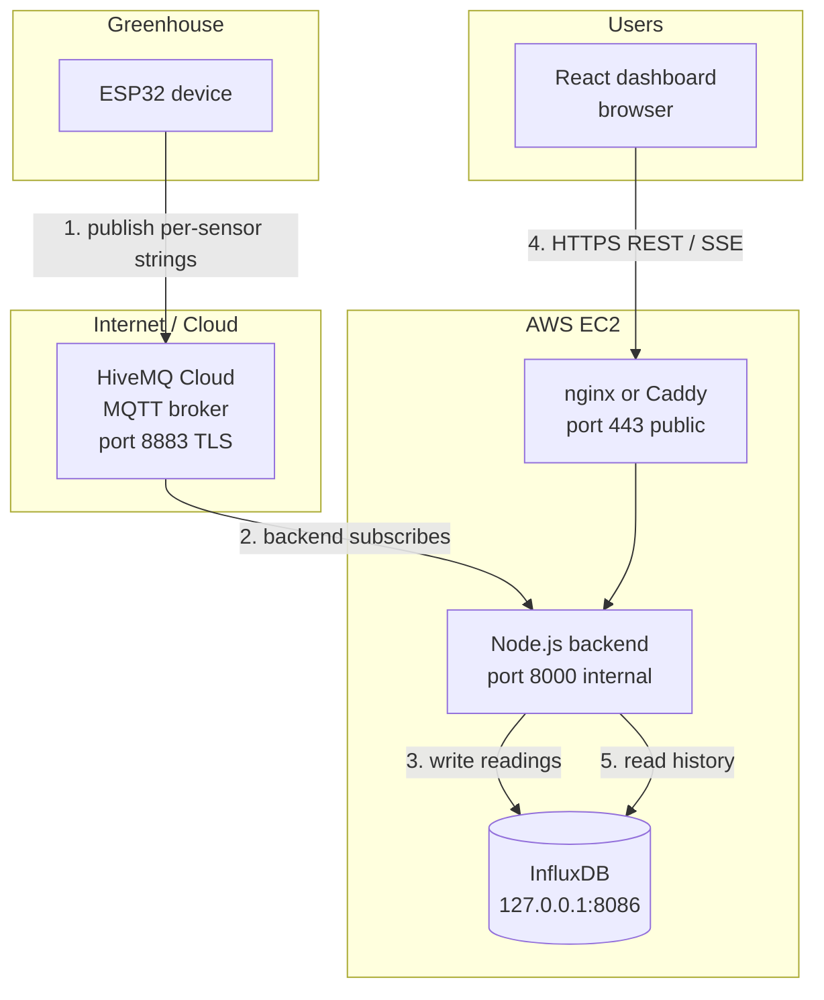
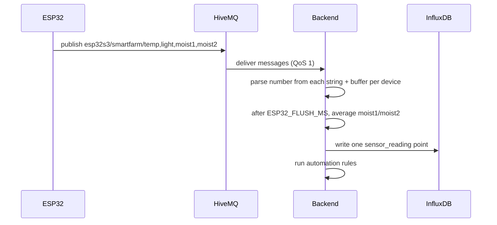
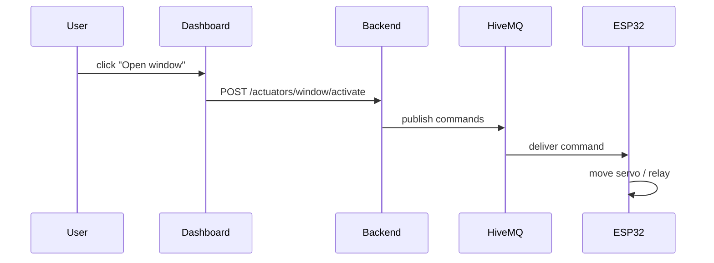
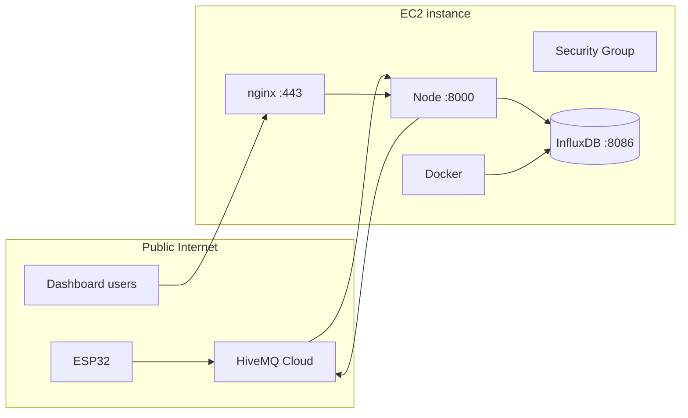
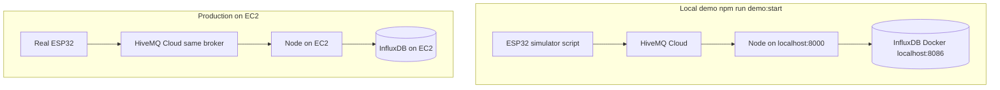

# Smart Greenhouse — System Architecture & Data Flow

This document explains how the whole system works in simple terms: what each piece does, how they connect, and how sensor data travels from your ESP32 in the greenhouse to your dashboard on AWS.

---

## The big picture (one sentence)

**The ESP32 sends sensor readings to HiveMQ Cloud over the internet; your Node.js backend on EC2 listens to HiveMQ, saves data in InfluxDB, and serves it to your dashboard via REST API.**

The ESP32 never talks directly to EC2. HiveMQ Cloud sits in the middle like a post office for messages.

---

## Who is who?

| Component | What it is | Where it runs |
|-----------|------------|---------------|
| **ESP32** | Small computer with sensors (temperature, soil moisture, light) and actuators (servo, pump, lights) | In your greenhouse, on WiFi |
| **HiveMQ Cloud** | Managed MQTT message broker — routes messages between devices and backend | HiveMQ’s servers (cloud) |
| **Node.js backend** | This repo — validates data, stores it, runs automation, exposes API | AWS EC2 |
| **InfluxDB** | Time-series database — stores every sensor reading with a timestamp | Same EC2 (private, localhost only) |
| **React dashboard** | Web UI showing live charts, alerts, manual controls | Browser / S3+CloudFront / same EC2 |

---

## High-level diagram



---

## What is MQTT and why HiveMQ?

**MQTT** is a lightweight publish/subscribe protocol made for IoT. Devices **publish** messages to **topics** (like channels). Other clients **subscribe** to topics and receive those messages.

**HiveMQ Cloud** is a hosted MQTT broker. You don’t install or maintain MQTT software on EC2 — both ESP32 and backend connect outbound to HiveMQ over **TLS** (`mqtts://` on port **8883**).

Think of it like this:

- **Topic** = mailbox name (e.g. `esp32s3/smartfarm/temp`)
- **Publish** = put a letter in the mailbox
- **Subscribe** = ask the post office to forward letters from that mailbox to you
- **HiveMQ** = the post office

---

## Step-by-step: how sensor data flows

### Step 1 — ESP32 reads sensors

Every few seconds the ESP32:

1. Reads BMP280 temperature
2. Reads two soil moisture sensors (`moist1`, `moist2`)
3. Reads LDR light sensor (0–100%)
4. Builds **one human-readable string per sensor** (no JSON)

### Step 2 — ESP32 publishes to HiveMQ

The ESP32 connects to HiveMQ Cloud:

```
mqtts://your-cluster.s1.eu.hivemq.cloud:8883
```

It **publishes one string per sensor** to separate topics (the topic carries no
device id):

```
esp32s3/smartfarm/temp    → "Temperature    :24.50 °C"
esp32s3/smartfarm/light   → "Light Intensity    :60% (Raw ADC: 2048);"
esp32s3/smartfarm/moist1  → "Soil Moisture_1    :45% (Raw ADC: 2048);"
esp32s3/smartfarm/moist2  → "Soil Moisture_2    :50% (Raw ADC: 2048);"
```

- **QoS 1** = “at least once” delivery (broker retries if needed)
- Uses **username + password** from HiveMQ console
- Connection is **encrypted** (TLS)

The ESP32 does **not** need EC2’s IP address. It only needs WiFi + HiveMQ credentials.

### Step 3 — Backend on EC2 subscribes to HiveMQ

When your Node backend starts on EC2, it:

1. Connects to the **same** HiveMQ cluster (same URL and credentials in `.env`)
2. Subscribes to: `esp32s3/smartfarm/+`  
   (`+` matches `temp`, `light`, `moist1`, `moist2`)
3. Waits for messages

Relevant config on EC2:

```env
MQTT_URL=mqtts://your-cluster.s1.eu.hivemq.cloud:8883
MQTT_USERNAME=your-hivemq-username
MQTT_PASSWORD=your-hivemq-password
MQTT_SUBSCRIBE_TOPIC=esp32s3/smartfarm/+
ESP32_DEVICE_ID=esp32-01
ESP32_FLUSH_MS=2000
```

Connection direction: **EC2 → HiveMQ** (outbound). You do **not** open MQTT ports on EC2’s firewall.

### Step 4 — Backend validates and saves to InfluxDB

For each MQTT message:



1. Parse the leading number from each per-sensor string
2. Buffer fields per device, average `moist1`/`moist2` into `soilMoisture`
3. Clamp values to valid ranges (`temperature`, `soilMoisture`, `lightLevel` — no humidity)
4. Write to InfluxDB with tag `deviceId=esp32-01`
5. Run automation (pump / lights / window thresholds)
6. Broadcast to SSE clients (live dashboard updates)

InfluxDB runs **on the same EC2 instance**, bound to localhost:

```env
INFLUX_URL=http://127.0.0.1:8086
```

Only the backend can reach InfluxDB — not the public internet.

### Step 5 — Dashboard retrieves data from the API

The dashboard **never** connects to MQTT or the ESP32 directly. It calls your backend over **HTTPS**:

| What you need | API endpoint |
|---------------|--------------|
| Latest reading | `GET /api/v1/sensors/latest?deviceId=esp32-01` |
| History / charts | `GET /api/v1/sensors/history?deviceId=esp32-01&window=24h` |
| Dashboard tiles + status | `GET /api/v1/dashboard/overview?deviceId=esp32-01` |
| Live updates | `GET /api/v1/dashboard/stream` (SSE) |
| Manual pump/lights/window | `POST /api/v1/actuators/pump/activate?deviceId=esp32-01` |
| Health check | `GET /api/v1/health` |

Example after deploy:

```bash
curl "https://api.yourdomain.com/api/v1/sensors/latest?deviceId=esp32-01"
```

Response comes from **InfluxDB** (stored history), not by polling the ESP32.

---

## Commands: backend → ESP32

> **Important — current firmware limitation.** The ESP32 firmware in use does
> **not** subscribe to any command topic. It controls the window **locally** on
> the device (`temperature > 27°C`). The backend's actuator API and automation
> engine still run and track state, but those commands **cannot reach this
> firmware**. To enable real remote actuation, the firmware must add an MQTT
> subscribe handler and act on incoming command messages.

The backend's actuator state machine and automation still operate so the
dashboard reflects intended state. If/when the firmware adds a subscribe
handler, point it at a command topic and parse a simple payload (the shape below
is a suggestion, not enforced):

```json
{
  "actuator": "window",
  "action": "activate",
  "source": "auto",
  "timestamp": "2026-06-16T10:30:05.000Z"
}
```

| Field | Values |
|-------|--------|
| `actuator` | `pump`, `lights`, `window` |
| `action` | `activate`, `deactivate`, `stop` |
| `source` | `manual`, `auto` |

Flow:



---

## AWS EC2 layout (production)



### What runs on EC2

| Process | How to run | Port | Public? |
|---------|------------|------|---------|
| InfluxDB | Docker Compose | 8086 | **No** — localhost only |
| Node backend | PM2 or systemd | 8000 | **No** — behind reverse proxy |
| nginx / Caddy | systemd | 443 | **Yes** — API + optional frontend |

### Security group (firewall) rules

| Inbound | Who | Why |
|---------|-----|-----|
| 22 | Your IP only | SSH admin |
| 443 | 0.0.0.0/0 (or CloudFront) | HTTPS API for dashboard |

| Do NOT open | Why |
|-------------|-----|
| 1883 / 8883 | MQTT is on HiveMQ Cloud, not EC2 |
| 8086 | InfluxDB must stay private |
| 8000 | Node should sit behind nginx |

**Outbound:** allow all (EC2 must reach HiveMQ Cloud and package repos).

### Production `.env` on EC2 (summary)

```env
NODE_ENV=production
PORT=8000

INFLUX_URL=http://127.0.0.1:8086
INFLUX_TOKEN=<strong-token>
INFLUX_ORG=greenhouse
INFLUX_BUCKET=greenhouse

MQTT_URL=mqtts://your-cluster.s1.eu.hivemq.cloud:8883
MQTT_USERNAME=<hivemq-user>
MQTT_PASSWORD=<hivemq-password>
MQTT_SUBSCRIBE_TOPIC=esp32s3/smartfarm/+
ESP32_DEVICE_ID=esp32-01

AUTH_ENABLED=true
JWT_SECRET=<long-random-string>
CORS_ORIGINS=https://your-dashboard.com
```

---

## Local demo vs production

Both use the **same HiveMQ Cloud broker**. The difference is where InfluxDB and the API run.



| | Local demo | Production (EC2) |
|--|------------|------------------|
| MQTT broker | HiveMQ Cloud | HiveMQ Cloud (same) |
| InfluxDB | Docker on laptop | Docker on EC2 |
| Backend | `npm run dev` | PM2 + built `dist/` |
| ESP32 | Simulator script | Real hardware |
| API URL | `http://localhost:8000` | `https://api.yourdomain.com` |

---

## MQTT topics reference

Prefix is configurable via `MQTT_TOPIC_PREFIX` (default: `greenhouse`).

| Direction | Topic | Purpose |
|-----------|-------|---------|
| ESP32 → backend | `esp32s3/smartfarm/temp` | Temperature (string) |
| ESP32 → backend | `esp32s3/smartfarm/light` | Light intensity (string) |
| ESP32 → backend | `esp32s3/smartfarm/moist1` | Soil moisture 1 (string) |
| ESP32 → backend | `esp32s3/smartfarm/moist2` | Soil moisture 2 (string) |

Backend subscribes to: `esp32s3/smartfarm/+`. Commands back to the device are
not delivered (firmware does not subscribe — see the Commands section).

---

## Automation rules (current)

After each reading is ingested, the backend evaluates these rules and updates
actuator state (command delivery to the device requires firmware that subscribes
— see the Commands section):

| Actuator | Turn ON when | Turn OFF when |
|----------|--------------|---------------|
| **Pump** | soil moisture &lt; 50% | soil moisture &gt; 80% |
| **Lights** | light &lt; 30% | light &gt; 70% |
| **Window** | temperature &gt; 27°C | temperature &lt; 24°C |

Thresholds live in `src/constants/sensorThresholds.ts`.

---

## Common questions

### Does the ESP32 connect to EC2’s public IP?

**No.** ESP32 and EC2 both connect **outbound** to HiveMQ Cloud. EC2 does not need a fixed IP for MQTT.

### Does the dashboard read from HiveMQ?

**No.** Dashboard → HTTPS → Node API → InfluxDB.

### What if MQTT disconnects?

- Backend auto-reconnects every few seconds
- API keeps serving **historical** data from InfluxDB
- ESP32 firmware should also reconnect WiFi and MQTT in a loop

### What if credentials are wrong?

You’ll see `Connection refused: Not authorized`. Fix: in HiveMQ Cloud console, copy URL + username + password from the **same cluster** into both ESP32 firmware and EC2 `.env`.

### Can I run HiveMQ on EC2 instead of Cloud?

Yes, but this project is set up for **HiveMQ Cloud (Option A)**. Self-hosting Mosquitto on EC2 means opening port 8883 publicly and managing TLS yourself.

---

## Reliability checklist

- [ ] ESP32 and backend use the **same** HiveMQ cluster and credentials
- [ ] ESP32 publishes per-sensor strings to `esp32s3/smartfarm/*`
- [ ] Backend `MQTT_SUBSCRIBE_TOPIC=esp32s3/smartfarm/+` and `ESP32_DEVICE_ID` set
- [ ] (Optional) firmware adds an MQTT subscribe handler if remote commands are needed
- [ ] InfluxDB on EC2 is **not** exposed to the internet
- [ ] API is served over **HTTPS** (nginx/Caddy + Let’s Encrypt)
- [ ] `AUTH_ENABLED=true` in production
- [ ] InfluxDB data volume on EBS (survives EC2 restarts)

---

## Related docs

- [README.md](./README.md) — API reference, config, scripts
- [DEMO.md](./DEMO.md) — local end-to-end demo walkthrough
