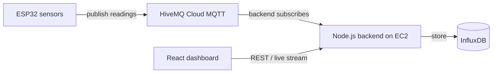

# Smart Greenhouse — Project Report

## 1. Overview

The Smart Greenhouse is an IoT system that monitors a greenhouse environment and
automates its climate. An **ESP32** microcontroller reads sensors (temperature,
soil moisture, light) and sends the data to the cloud. A **backend** stores that
data, evaluates rules, and serves it to a **dashboard** for live monitoring.

The project was built by a small team:

This report focuses on **my part: the backend service and the end-to-end
integration** that connects the hardware, the message broker, the database, and
the API.

---

## 2. My Contribution (scope)

- Designed and built the **Node.js backend** (REST API + real-time stream).
- Built the **MQTT integration** that ingests live ESP32 sensor data.
- Set up the **InfluxDB** time-series storage and query layer.
- Implemented **automation rules** and **alerting**.
- Wrote the **cloud infrastructure** (Terraform) to deploy everything on AWS.
- Handled the **integration glue** so the ESP32, broker, backend, and DB all
  work together reliably.

---

## 3. How It All Connects

The ESP32 never talks to the server directly. Both connect *outbound* to a
managed MQTT broker (**HiveMQ Cloud**), which relays messages between them. This
keeps the setup simple and secure (no open ports on the server for the device).



**Data flow in one line:** ESP32 → HiveMQ Cloud → Backend → InfluxDB → API → Dashboard.

---

## 4. Technology Stack (backend)

| Concern | Choice |
|---------|--------|
| Language / runtime | TypeScript on Node.js |
| Web framework | Express |
| Messaging | MQTT over TLS (HiveMQ Cloud, port 8883) |
| Database | InfluxDB 2 (time-series) |
| Validation | Zod |
| Real-time to UI | Server-Sent Events (SSE) |
| API docs | OpenAPI / Swagger UI |
| Infrastructure | Terraform + AWS EC2 |

---

## 5. The Integration (the core of my work)

The trickiest part was making the backend speak the **exact format the ESP32
firmware already used** — without asking the hardware teammate to rewrite it.

**What the ESP32 sends:** instead of one tidy JSON message, the firmware
publishes **four separate plain-text strings**, one per sensor:

```
esp32s3/smartfarm/temp    → "Temperature    :24.50 °C"
esp32s3/smartfarm/light   → "Light Intensity    :60% (Raw ADC: 2048);"
esp32s3/smartfarm/moist1  → "Soil Moisture_1    :45% (Raw ADC: 2048);"
esp32s3/smartfarm/moist2  → "Soil Moisture_2    :50% (Raw ADC: 2048);"
```

**What the backend does with them:**

1. Subscribes to `esp32s3/smartfarm/+` (all four topics).
2. Parses the number out of each text string.
3. Buffers the readings per device and **averages the two soil sensors** into a
   single soil-moisture value.
4. After a short debounce window, writes **one combined reading** to InfluxDB.
5. **Clamps** values to valid ranges so a real reading is never dropped.

This makes the backend "align to the hardware" rather than forcing the hardware
to change — a key requirement from the team.

---

## 6. REST API

Base URL: `/api/v1`

| Method | Endpoint | Purpose |
|--------|----------|---------|
| GET | `/health` | Service + MQTT + DB status |
| POST | `/sensors/data` | HTTP ingestion fallback |
| GET | `/sensors/latest` | Most recent reading |
| GET | `/sensors/history` | Raw readings over a time window |
| GET | `/sensors/aggregate` | Mean / min / max / median over a window |
| GET | `/dashboard/overview` | Latest values + per-sensor status |
| GET | `/dashboard/stream` | Live updates (SSE) for the dashboard |
| GET | `/actuators/state` | Current actuator states |
| POST | `/actuators/{pump\|lights\|window}/{activate\|deactivate\|stop}` | Control actuators |
| GET | `/alerts` | Active sustained-condition alerts |
| POST | `/auth/login` | JWT login (optional auth) |

All responses use a consistent `{ success, data/message }` envelope. Interactive
docs are auto-generated at `/api-docs` (Swagger).

---

## 7. Automation & Alerts

After every reading, the backend evaluates control rules:

| Actuator | Turn ON | Turn OFF |
|----------|---------|----------|
| Pump | soil moisture < 50% | soil moisture > 80% |
| Lights | light < 30% | light > 70% |
| Window | temperature > 27°C | temperature < 24°C |

It also raises **alerts** when a bad condition persists (e.g. temperature above
30°C for several hours, prolonged dryness, or extended darkness).

Sensor values are also classified as **optimal / warning / critical** for the
dashboard status tiles.

---

## 8. Data Storage (InfluxDB)

Readings are stored as time-series points:

```
measurement: sensor_reading
tags:   deviceId
fields: temperature (°C), soilMoisture (%), lightLevel (%), waterLevel (%)
time:   reading timestamp
```

Writes are batched for efficiency, and `deviceId` as a tag keeps per-device
queries fast. InfluxDB runs privately (localhost only) and is never exposed to
the internet.

---

## 9. Deployment (Infrastructure as Code)

The entire cloud setup is automated with **Terraform**, so it can be recreated
with a few commands:

- **AWS EC2** instance (Frankfurt region) running the backend + InfluxDB.
- A **bootstrap script** auto-installs Docker, Node.js, and InfluxDB, clones the
  repo, builds it, and runs it as a service on port 80 — all on first boot.
- **Security group** allows only SSH and HTTP inbound; all MQTT traffic is
  outbound to HiveMQ Cloud (no broker hosted by us).
- **Terraform state** is stored remotely in **S3** with locking, so the infra is
  safe to manage and reproducible.
- `terraform destroy` cleanly removes everything except the saved state bucket.

---

## 10. Key Challenges & How I Solved Them

| Challenge | Solution |
|-----------|----------|
| ESP32 sends fragmented text, not JSON | Backend parses + combines the per-sensor strings natively |
| Two soil sensors, one value needed | Average both into a single `soilMoisture` |
| Sensor has no humidity (BMP280) | Removed humidity from the whole pipeline |
| Light sent as a percentage, not lux | Standardized the backend to 0–100% |
| Out-of-range values risk dropped data | Clamp values so readings are always stored |
| Reliable cloud deploy | Terraform + auto-bootstrap + S3 remote state |

---

## 11. Verification

The integration was tested end-to-end, not just in theory:

- Confirmed the backend **connects to HiveMQ Cloud** and subscribes to the ESP32
  topics (live connection test).
- Ran the **full local demo** (simulated ESP32 → broker → backend → InfluxDB →
  API) and confirmed correct parsing, soil averaging, and stored values.
- Verified the API health, latest-reading, and dashboard endpoints return live
  data.

---

## 12. Known Limitation

The current ESP32 firmware **only publishes** sensor data — it does not listen
for commands. So while the backend can send actuator commands (and tracks their
state), those commands are **not delivered to the device**; the window is
controlled locally on the ESP32 by its own temperature reading. Enabling true
remote control would require a small firmware change (subscribe to a command
topic). This is a hardware-side change, outside the backend scope.

---

## 13. Summary

My work delivered a **reliable backend and a working integration** that turns raw
ESP32 sensor messages into stored, queryable, real-time data with automation and
alerting — deployed to the cloud through fully automated infrastructure. The
backend was deliberately designed to **fit the existing hardware**, which made
the overall system come together with minimal friction across the team.
