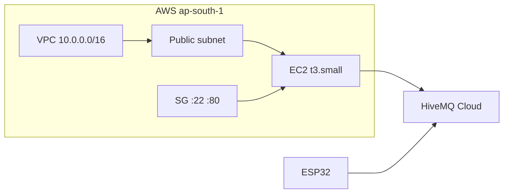

# Terraform — AWS demo infrastructure

Provisions a **single EC2 instance** in a **public subnet** (public IP, no NAT) that runs:

- **InfluxDB** in Docker on `127.0.0.1:8086`
- **Node.js backend** on port **80**, cloned from GitHub on first boot
- Outbound connection to **HiveMQ Cloud** for ESP32 telemetry and actuator commands

After `terraform apply`, use the printed `health_url` to confirm `mqtt: connected` and `influxdb: connected`.

See also [ARCHITECTURE.md](../ARCHITECTURE.md) for the full data flow.

---

## Prerequisites

| Tool | Notes |
|------|-------|
| [Terraform](https://developer.hashicorp.com/terraform/install) | >= 1.10 (native S3 state locking) |
| AWS CLI configured | `aws configure` or env vars |
| EC2 key pair | Create in AWS console; set `key_name` in tfvars |
| HiveMQ Cloud cluster | Same URL/credentials as your ESP32 |

---

## Remote state (S3)

State is stored in S3 with native locking (no DynamoDB). The state bucket must
exist **before** the main stack can use it, so it lives in a separate one-time
module: `state-backend/`.

```bash
# 1. Create the state bucket ONCE (uses local state).
cd infra/state-backend
terraform init
terraform apply        # creates S3 bucket "smart-greenhouse-tfstate"
```

S3 bucket names are **globally unique**. If `smart-greenhouse-tfstate` is taken,
change `state_bucket_name` in `state-backend/variables.tf` **and** the matching
`bucket` in `backend.tf` to the same new name.

---

## Quick start (main stack)

```bash
cd infra
cp terraform.tfvars.example terraform.tfvars
# Edit terraform.tfvars — key_name, mqtt_*, influx_*, jwt_secret

terraform init        # initializes the S3 backend created above
terraform plan
terraform apply
```

First boot takes **~5–10 minutes** (apt, Docker, `npm ci`, build). Watch progress:

```bash
terraform output bootstrap_log_hint
# ssh ubuntu@<ip> 'sudo tail -f /var/log/greenhouse-bootstrap.log'
```

---

## Outputs

| Output | Description |
|--------|-------------|
| `instance_public_ip` | EC2 public IP |
| `api_base_url` | `http://<ip>/api/v1` |
| `health_url` | Liveness + MQTT/Influx status |
| `swagger_url` | OpenAPI UI |
| `ssh_command` | SSH hint |
| `example_actuator_curl` | Sample pump activate |

### Verify ESP32 pipeline

```bash
curl "$(terraform output -raw health_url)"
curl "$(terraform output -raw api_base_url)/sensors/latest?deviceId=esp32-01"
```

### Control ESP32 actuators (HTTP → MQTT → device)

```bash
curl -X POST "$(terraform output -raw api_base_url)/actuators/window/activate?deviceId=esp32-01"
curl -X POST "$(terraform output -raw api_base_url)/actuators/pump/deactivate?deviceId=esp32-01"
```

---

## What gets created



| Resource | Module |
|----------|--------|
| VPC + public subnet + IGW | `terraform-aws-modules/vpc/aws` |
| Security group | `terraform-aws-modules/security-group/aws` |
| EC2 instance | `terraform-aws-modules/ec2-instance/aws` |

**Not created:** NAT gateway, private subnets, ALB, RDS, self-hosted MQTT.

---

## Variables (summary)

| Variable | Default | Purpose |
|----------|---------|---------|
| `region` | `ap-south-1` | AWS region |
| `instance_type` | `t3.small` | EC2 size |
| `key_name` | — | SSH key pair (required) |
| `allowed_cidr` | `0.0.0.0/0` | Who can reach :22 and :80 |
| `git_repo` / `git_branch` | GitHub main | Code deployed on boot |
| `mqtt_url` / `mqtt_username` / `mqtt_password` | — | HiveMQ Cloud |
| `influx_token` / `influx_password` | — | Local InfluxDB init |
| `auth_enabled` | `false` | JWT for API (demo off) |

Full list: [variables.tf](./variables.tf).

---

## Bootstrap (user_data)

On first boot, [bootstrap/user_data.sh.tpl](./bootstrap/user_data.sh.tpl) runs as root:

1. Install Docker, Node 20, git
2. Add 2 GB swap
3. Start InfluxDB container (`127.0.0.1:8086` only)
4. `git clone` → `npm ci` → `npm run build`
5. Write `/opt/app/.env` with HiveMQ + Influx settings
6. Enable `greenhouse.service` (systemd) on port 80

Logs: `/var/log/greenhouse-bootstrap.log`

Service status:

```bash
sudo systemctl status greenhouse
sudo journalctl -u greenhouse -f
```

---

## Security notes (demo only)

- `allowed_cidr = "0.0.0.0/0"` opens SSH and HTTP to the world — use your IP (`x.x.x.x/32`) when possible.
- InfluxDB is **not** exposed publicly (Docker bound to localhost).
- MQTT uses outbound TLS to HiveMQ — no inbound 8883 on EC2.
- `terraform.tfvars` contains secrets — **never commit it** (gitignored).
- Port 80 runs as root via systemd for demo simplicity.

---

## Destroy

```bash
terraform destroy
```

Removes VPC, EC2, security group. InfluxDB data on the instance is destroyed with the VM (no persistent EBS beyond root volume).

---

## Troubleshooting

| Issue | Fix |
|-------|-----|
| `mqtt: disconnected` in health | Check `mqtt_url` / username / password match HiveMQ console and ESP32 |
| Bootstrap still running | `sudo tail -f /var/log/greenhouse-bootstrap.log` |
| `npm run build` failed on instance | SSH in; check Node version; re-run bootstrap steps manually |
| Connection refused on :80 | Wait for bootstrap; `systemctl status greenhouse` |
| ESP32 data not showing | Confirm ESP32 publishes to `esp32s3/smartfarm/*` and the backend subscribes to `esp32s3/smartfarm/+` |

---

## Re-deploy app code without recreating EC2

SSH in and pull latest:

```bash
cd /opt/app
sudo git pull
sudo npm ci
sudo npm run build
sudo systemctl restart greenhouse
```

Or change `user_data` / taint instance: `terraform taint module.ec2.aws_instance.this[0]` then `terraform apply` (recreates VM).
